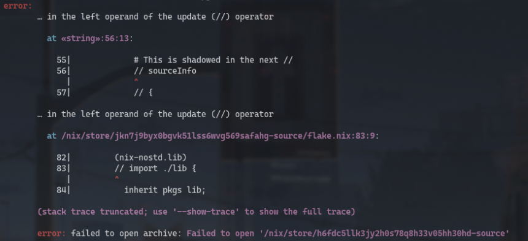

# Disaster recovery

> [!CAUTION]
> This could require you more disks!

1. [NixOS and/or Home manager **rebuild** fails with error _"failed to open '/nix/store/\*-source'"_](https://discourse.nixos.org/t/nix-flakes-nix-store-source-no-such-file-or-directory/17836/9)

    

2. [Wireless connection instantly fails on startup when just switched from Windows](https://wireless.wiki.kernel.org/en/users/drivers/iwlwifi#about_dual-boot_with_windows_and_fast-boot_enabled).
3. **macOS VM fails to build.** Ensure to enable the virtualisation capacibilities for your CPU in your **BIOS**. You might find this option as "Intel (VMX) Virtualization Technology".
4. In middle of a `nixos-rebuild` the screen may freeze and then the /boot partition will not mount correctly so when you restart the computer you will have the GRUB Rescue menu and nothing else.
 Trying to fix that problem from there wont be easy so you might need a Live USB with NixOS as part of your contigency plan. Once you're in, execute the following commands:

    ```shell
    $ sudo mkdir -p /mnt && sudo mount /dev/nvme0n1p6 /mnt && sudo mount /dev/nvme0n1p1 /mnt/boot
    $ sudo nixos-enter
    $ cd /home/luisnquin/.dotfiles; unset SUDO_USER && nixos-rebuild boot --flake .#nyx
    ```

5. If the _/nix/store_ appears to be **corrupted**  you might want to just execute this `sudo nix-store --repair --verify --check-contents`.
